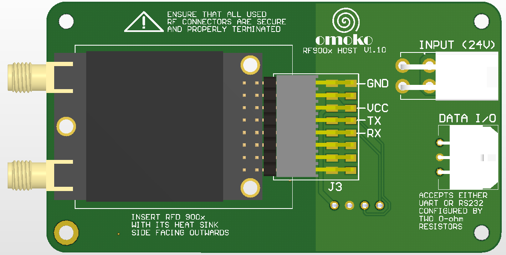
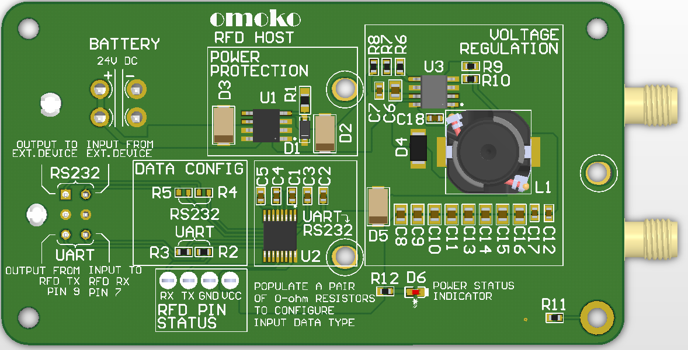

# omoko Power Supply Board

## About the PCB
A board to host RFD 900x radio. It is a 4-layer board that have a wide range of power input and both TTL and RS232 data interfacing options.

## Requirements
1. Power: 6S Battery DC.
2. Data: TTL and RS232 based on 0-ohm resistor configuration.

## Current revision
Version 1.0

## Future versions
1. Change power input option from 6S battery to 5.5-25.2 VDC.
